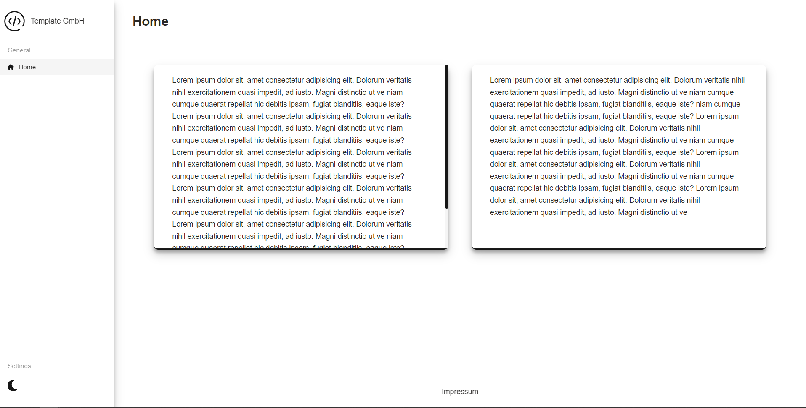

# React-Template

A web app template built with React, TypeScript and SCSS

## Features

- SCSS setup with custom [mixins](./src/scss/abstracts/_mixins.scss), [fonts](./src/scss/abstracts/_fonts.scss), [colors](./src/scss/abstracts/_colors.scss) and a responsive layout
- Redux setup
- Light and dark mode
- Custom hooks for [GET](./src/hooks/useFetch.ts) and [POST](./src/hooks/usePost.ts) requests
- Customizable components via props:
  - [Button.tsx](./src/components/ui-elements/Button.tsx)
  - [FeedbackCard.tsx](./src/components/ui-elements/FeedbackCard.tsx)
  - [Icon.tsx](./src/components/ui-elements/Icon.tsx)
  - [Modal.tsx](./src/components/ui-elements/Modal.tsx)
  - [ToggleSwitch.tsx](./src/components/ui-elements/ToggleSwitch.tsx)
- Unit (Jest) and E2E (Cypress) test setup
- Automated [test and build workflow](./.github/workflows/test_and_build.yml) on PRs targeting the main branch

## Setup

1. Clone this repository with `git clone https://github.com/Fuggel/React-Template.git`.
2. For development you need to have [node](https://nodejs.org/en/) (LTS version) installed.
3. Copy the content of `env.example` in the projects root directory, create a `.env` file and add your desired environment variables.

## Development

In your CLI, navigate to the root directory of the cloned repository and run the following commands:

1. `npm i` to install all dependencies for this project.
2. `npm start` to start the server and open the project on [http://localhost:3000/](http://localhost:3000/)
